# Hi there, I'm Mohamed Salah 👋

> Software engineer with a passion for building things that work — and things that look good doing it.
> Open to collaboration and freelance opportunities. Feel free to explore or reach out.

  
  
  

---

## Overview

  
  &nbsp;&nbsp;&nbsp;&nbsp;
  

---

## GitHub Stats

---

## Tech Stack

A snapshot of the tools and technologies I work with regularly:

**Languages**

**Frameworks & Libraries**

**Databases**

**DevOps & Infrastructure**

**Tooling & Platforms**

**Web3 & Other**

---

## Language Stats

**All-time usage**

**Recently active**

---

## Coding Habits

---

## Contribution Graph

<picture>
  <source media="(prefers-color-scheme: dark)" srcset="https://raw.githubusercontent.com/mohSalah66/mohSalah66/output/github-snake-dark.svg" />
  <source media="(prefers-color-scheme: light)" srcset="https://raw.githubusercontent.com/mohSalah66/mohSalah66/output/github-snake.svg" />
  
</picture>

---

  Thanks for stopping by — feel free to reach out via my <a href="https://mohsalah.net">website</a> or any of the links above.

